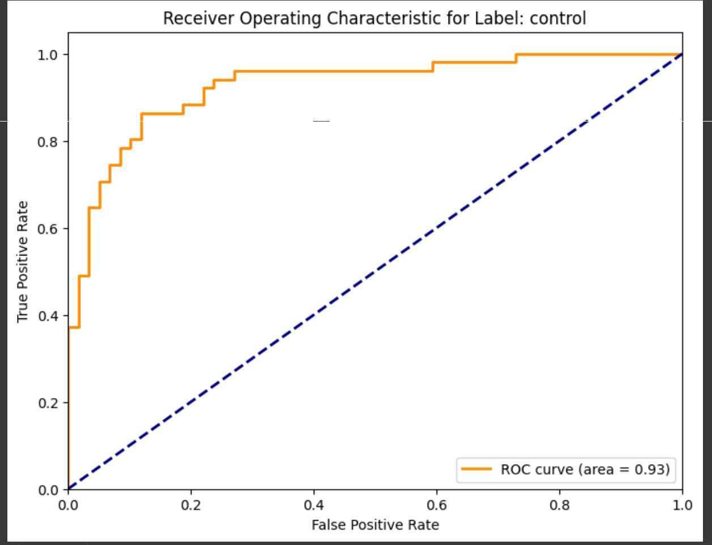
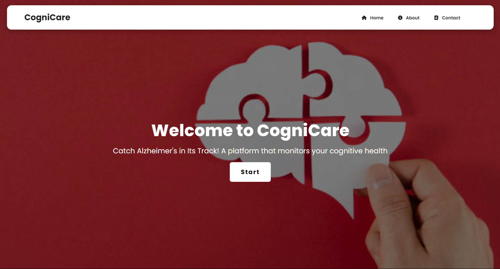
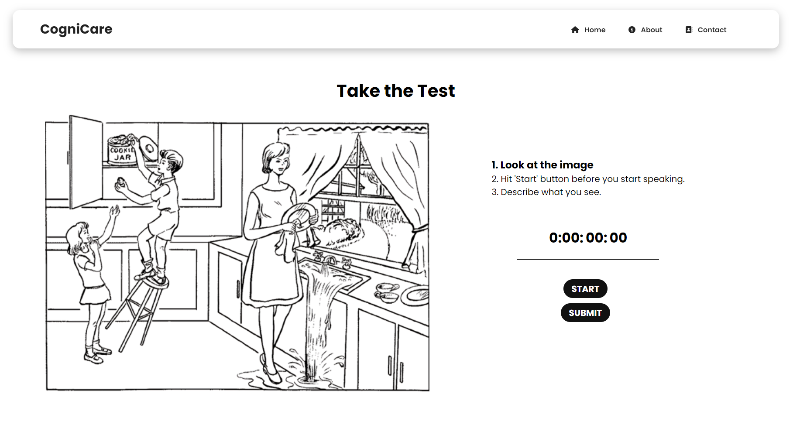
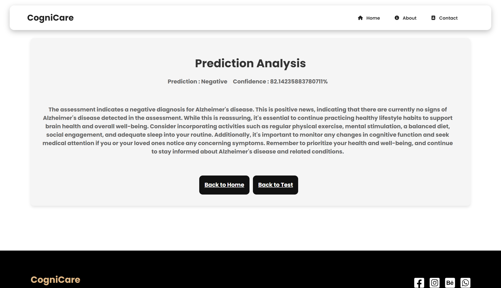

# Alzheimer's Early Detection Using NLP on Speech Recognition

## Project Overview

This project aims to develop a system for early detection of Alzheimer's disease through natural language processing (NLP) techniques applied to speech recognition data. By analyzing speech patterns, we aim to identify early signs of cognitive decline associated with Alzheimer's

The app predicts the likelihood of Alzheimer's for potential patients by analysing speech inputs.

## Table of Contents

- [Project Overview](#project-overview)
- [Installation](#installation)
- [Usage](#usage)
- [Features](#features)
- [Dataset](#dataset)
- [Model](#model)
- [Results](#results)
- [Contributing](#contributing)
- [License](#license)
- [Acknowledgments](#acknowledgments)
- [Screenshots](#website-interface)

## Installation

To set up the project locally, follow these steps:

1. **Clone the repository:**

    ```bash
    git clone https://github.com/42bismuth/Alzheimer-Detection.git
    cd Alzheimers-Detection
    ```

2. **Create a virtual environment:**

    ```bash
    python -m venv venv
    source venv/bin/activate   # On Windows use `venv\Scripts\activate`
    ```

3. **Install the required packages:**

    ```bash
    pip install -r requirements.txt
    ```

4. **Install dependencies for the frontend**

    ```bash
    cd client && npm i
    ```

## Usage

To run the project, follow these steps:

1. **To run the backend:**
   Run the `app.py` file.

2. **To run frontend:**

    ```bash
    cd client
    npm start
    ```

## Features

- **Speech Recognition:** Transcribe audio recordings to text using Assembly AI voice-to-text model.
- **NLP Analysis:** Performed detailed analysis of the transcriptions to identify linguistic patterns and markers that are indicative of Alzheimer's Disease.
Implement various Natural Language Processing techniques to enhance the accuracy and reliability of the analysis.
- **React UI:** Developed a modern, intuitive user interface using React to facilitate easy interaction with the system.
Ensured the UI is user-friendly, responsive, and capable of displaying results and insights from the speech recognition and NLP analysis clearly.

## Dataset

Details about the dataset used in this project:

- **Source:** [DementiaBank](https://www.tensorflow.org/datasets/catalog/dementiabank)
- **Description:** DementiaBank contains audio recordings of 117 individuals with Alzheimer's Disease and 93 healthy individuals describing an image. The task is to classify these groups based only on the audio, as no text features are included.
- **Data extraction:** Extracted plain text from speech transcripts using `pylangacq`

## Model

Description of the model training process:

- **Training:** Information on how the model was trained, including hyperparameters, training duration, etc.
- **Model Training:** Train machine learning models to detect early signs of Alzheimer's from speech data. Models used:
    1. Random Forest
    2. SVC+GRID Search
    3. Naive-Bayes SVC
    4. LSTM
    5. Bi-directional LSTM
- **Evaluation:** Metrics and results from evaluating the model on the test set and assess model performance using accuracy and F1 scores.

## Results

Summary of the project's results:

- **Accuracy:** Overall accuracy of the model is 84%.
- **ROC-AUC:** The ROC-AUC curve for the NB_SVC model obtained is:


## Contributing

We welcome contributions to improve this project. To contribute:

1. Fork the repository.
2. Create a new branch.
3. Make your changes and commit them.
4. Push your changes to your fork.
5. Create a pull request.

Please ensure your code adheres to our coding standards and include relevant tests.

## License

This project is licensed under the MIT License. See the [LICENSE](LICENSE) file for details.

## Acknowledgments

We would like to express our gratitude to the following:

- **DementiaBank:** Special thanks to Dr. Brian MacWhinney for providing access to the DementiaBank dataset.
- **AssemblyAI:** For their powerful speech-to-text API SDK, which facilitated the transcription of audio data.

## Website Interface

Here are some screenshots of the website UI:

### Home Page



### Analysis Page



### Results Page


"# Alzheimer_Detect" 
"# Alzheimer_Detect" 
"# Alzheimer_Detect" 
"# Alzheimer_Detect" 
